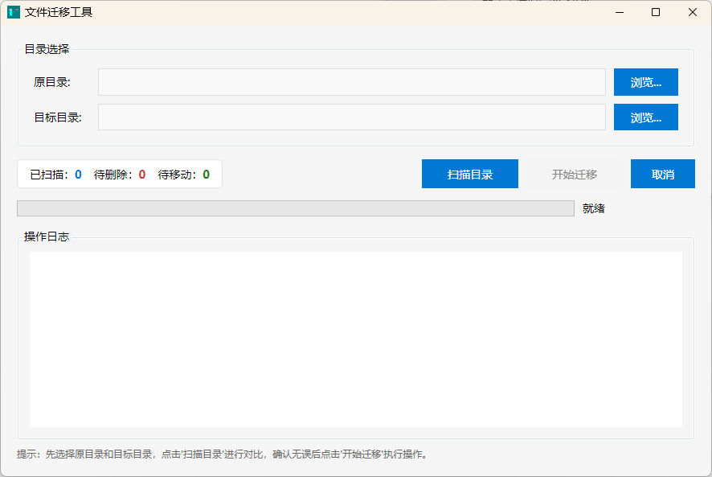

# 文件管理工具

一个基于 WPF 的桌面应用程序，提供文件对比迁移和按年份筛选迁移两大功能。



## 功能特性

### 🏠 主页
- 简洁的主页入口，卡片式功能选择界面

### 📁 文件迁移
- 📁 **智能对比** - 通过文件名 + MD5 Hash 精确判断文件是否重复
- 🗑️ **自动清理** - 目标目录已存在则删除原目录文件
- 📦 **自动迁移** - 目标目录不存在则移动到目标目录
- 📊 **迁移报告** - 生成详细的 CSV 格式报告
- 💾 **断点续传** - 支持中途关闭后恢复扫描进度
- ⚡ **高性能** - 并行扫描、流式 Hash 计算，支持百万级文件

### 📅 按年份迁移
- 🗓️ **年份筛选** - 按文件最后修改年份筛选目标文件
- 📝 **手动输入** - 支持手动输入年份（1970-2100），实时验证有效性
- 🔽 **快捷选择** - 下拉按钮快速选择年份
- ⚠️ **冲突检测** - 扫描前检测目标年份文件夹，存在文件时禁止操作
- 📊 **大小统计** - 扫描后显示待迁移文件总数和总大小（人性化格式）
- 💾 **迁移报告** - 迁移完成后弹出保存对话框，生成 CSV 报告

### 📦 同步到对象存储
- 🌐 **多平台支持** - AWS S3 / 阿里云 OSS / 腾讯云 COS / MinIO
- 🔐 **安全存储** - AccessKey/SecretKey 密码框输入
- 🔄 **灵活模式** - 仅上传新增 / 上传+更新 / 上传后删除本地
- 📊 **对比扫描** - 扫描本地文件，对比远程已存在文件，智能筛选
- 📝 **同步报告** - 完成后生成 CSV 报告

## 系统要求

- Windows 10/11
- .NET 10.0 运行时（使用独立发布版本则无需安装）

## 下载安装

### 方式一：独立发布版（推荐）

无需安装 .NET 运行时，解压即用：

1. 从 [Releases](https://github.com/your-username/file-sync/releases) 下载最新版本
2. 解压到任意目录
3. 双击 `file-sync.exe` 运行

### 方式二：源码编译

```bash
# 克隆仓库
git clone https://github.com/your-username/file-sync.git
cd file-sync

# 构建
dotnet build

# 运行
dotnet run

# 发布独立可执行文件
dotnet publish -c Release -r win-x64 --self-contained true -p:PublishSingleFile=true -o ../publish
```

**注意**：源码目录为 `src/`，请在 `src/` 目录下执行上述命令。

## 使用说明

### 文件迁移
1. **选择目录** - 点击"浏览"按钮分别选择原目录和目标目录
2. **扫描对比** - 点击"扫描目录"按钮，程序会自动对比两个目录
3. **确认操作** - 查看扫描结果（待删除/待移动文件列表）
4. **执行迁移** - 点击"开始迁移"按钮执行操作
5. **查看报告** - 迁移完成后自动生成 CSV 报告

### 按年份迁移
1. **选择源目录** - 点击"浏览"按钮选择要筛选的源目录
2. **选择年份** - 手动输入或使用下拉按钮选择年份（1970-2100）
3. **选择目标目录** - 点击"浏览"按钮选择目标目录
4. **扫描** - 点击"扫描"按钮，程序会检查目标年份文件夹冲突情况
5. **迁移** - 确认后点击"开始迁移"将文件移动到目标目录的年份子目录
6. **保存报告** - 迁移完成后选择保存 CSV 报告

### 同步到对象存储
1. **选择本地目录** - 点击"浏览"按钮选择要同步的本地目录
2. **配置存储** - 选择存储类型，填写 Endpoint、AccessKey、SecretKey、Bucket
3. **选择同步模式** - 仅上传新增 / 上传+更新 / 上传后删除本地
4. **扫描** - 点击"扫描"按钮，程序会对比本地和远程文件列表
5. **同步** - 确认后点击"开始同步"将文件上传到对象存储
6. **保存报告** - 同步完成后选择保存 CSV 报告

## 核心流程

```
┌─────────────┐     ┌─────────────┐     ┌─────────────┐     ┌─────────────┐
│   扫描源    │ →   │  扫描目标    │ →   │  对比文件    │ →   │  执行迁移    │
│   目录      │     │   目录      │     │ (文件名+Hash) │     │  (删除/移动) │
└─────────────┘     └─────────────┘     └─────────────┘     └─────────────┘
                                                                    ↓
┌─────────────┐                                             ┌─────────────┐
│  生成报告    │ ← ← ← ← ← ← ← ← ← ← ← ← ← ← ← ← ← ← ← ← ← │   CSV 报告   │
└─────────────┘                                             └─────────────┘
```

## 技术栈

| 组件 | 技术 |
|------|------|
| 框架 | WPF + .NET 10 |
| MVVM | CommunityToolkit.Mvvm 8.x |
| 数据库 | Microsoft.Data.Sqlite |
| Hash 算法 | MD5 (流式计算) |

## 项目结构

```
file-sync/
├── file-sync.sln                 # 解决方案文件
├── src/                          # 源代码
│   ├── file-sync.csproj
│   ├── App.xaml / App.xaml.cs    # 应用程序入口
│   ├── HomePage.xaml / .cs       # 主页（功能选择入口）
│   ├── MainWindow.xaml / .cs     # 文件迁移界面
│   ├── YearFilterMigrationWindow.xaml / .cs  # 按年份迁移界面
│   ├── ObjectStorageSyncWindow.xaml / .cs    # 对象存储同步界面
│   ├── ViewModels/
│   │   ├── MainViewModel.cs      # 文件迁移 MVVM 视图模型
│   │   ├── YearFilterMigrationViewModel.cs  # 年份迁移视图模型
│   │   └── ObjectStorageSyncViewModel.cs    # 对象存储同步视图模型
│   ├── Models/
│   │   └── FileEntry.cs          # 数据模型
│   └── Services/
│       ├── FileScanner.cs        # 目录扫描（并行）
│       ├── HashCalculator.cs     # MD5 Hash 计算（流式）
│       ├── FileComparator.cs     # 文件对比
│       ├── FileMigrator.cs       # 删除/移动操作
│       ├── CsvReportGenerator.cs # CSV 报告生成
│       └── AppState.cs           # SQLite 状态持久化
├── tests/                        # 单元测试
│   └── file-sync.Tests/
├── publish/                      # 发布输出
├── CLAUDE.md                     # AI 开发指南
├── .gitignore
└── README.md
```

## 性能优化

- ✅ `Directory.EnumerateFiles` 流式遍历（非 `GetFiles`）
- ✅ `ConcurrentBag` 并发收集扫描结果
- ✅ MD5 流式计算（1MB buffer，避免大文件内存溢出）
- ✅ SQLite 持久化支持断点续传
- ✅ 先比较文件大小再计算 Hash（减少不必要的计算）

## 迁移报告格式

CSV 报告包含以下字段：

| 字段 | 说明 |
|------|------|
| 操作类型 | Delete / Move / Skip / Error |
| 源路径 | 文件原始路径 |
| 目标路径 | 迁移后路径 |
| 文件大小 | 字节 |
| Hash 值 | MD5 校验值 |
| 状态 | Success / Failed / Skipped |
| 错误信息 | 失败原因 |

## 常见问题

**Q: 迁移过程中可以取消吗？**  
A: 可以，点击"取消"按钮即可停止当前操作。

**Q: 断点续传如何使用？**  
A: 程序会自动保存扫描进度，下次打开时会自动恢复上次的会话。

**Q: 文件移动后原名冲突怎么办？**  
A: 程序会自动添加后缀（如 `file_1.txt`, `file_2.txt`）避免冲突。

**Q: 按年份迁移如何避免覆盖目标目录已有文件？**  
A: 扫描前会检测目标年份文件夹，如果已存在且包含文件，则禁止操作，必须更换目标目录或清空文件夹。

## 版本历史

### v1.2.0 (2026-04-24)
- 📦 新增同步到对象存储功能（S3/OSS/COS/MinIO，扫描对比，上传+更新，CSV 报告）
- 🔐 AccessKey/SecretKey 密码框安全输入
- 🔄 支持三种同步模式（仅上传新增 / 上传+更新 / 上传后删除本地）

### v1.1.0 (2026-04-24)
- 🏠 新增主页，统一功能入口
- 📅 新增按年份迁移功能（年份筛选、手动输入、下拉选择、冲突检测、大小统计、CSV 报告）
- ⚡ 优化后台线程执行，UI 不卡顿
- 🔧 修复日志自动滚动、按钮状态重置等问题
- 🧪 新增 35 个单元测试覆盖核心服务

### v1.0.0 (2026-04-23)
- 🎉 初始版本：文件对比迁移

## License

MIT License

## 贡献

欢迎提交 Issue 和 Pull Request！

## 致谢

- 🤖 **AI 驱动开发** — 本项目由 Claude Code 辅助构建，代码生成、架构设计、性能优化均由 AI 完成
- 💪 **技术支持** — 基于 Qwen3.5 模型提供核心开发支持
